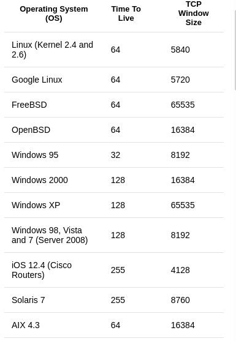

# NETWORK SCANNING

## 1. HOST DISCOVERY
### NMAP
    quickly discover devices in a given range
    nmap -sn <IP range>

    ARP ping scan
    nmap -sn -PR <target>  (-sn = disable port scan; -PR = perform ARP ping scan)

    UDP scan
    nmap -sn -PU [Target IP Address]   (-PU: performs the UDP ping scan.)

    ICMP ECHO ping scan
    nmap -sn -PE [Target IP Address]   (-PE: performs the ICMP ECHO ping scan.)

    ICMP Timestamp and Address Mask Ping Scan: These techniques are alternatives for the traditional ICMP ECHO ping scan, which are used to determine whether the target host is live specifically when administrators block the ICMP ECHO pings.

    ICMP timestamp ping scan
    nmap -sn -PP [target IP address]

    ICMP address mask ping scan
    nmap -sn -PM [target IP address]

    TCP ACK Ping Scan: This technique sends empty TCP ACK packets to the target host; an RST response means that the host is active.

    nmap -sn -PA [target IP address]

    IP Protocol Ping Scan: This technique sends different probe packets of different IP protocols to the target host, any response from any probe indicates that a host is active.

    nmap -sn -PO [target IP address]

### ANGRY IP SCANNER

You can also use other ping sweep tools such as SolarWinds Engineer’s Toolset (https://www.solarwinds.com), NetScanTools Pro (https://www.netscantools.com), Colasoft Ping Tool (https://www.colasoft.com), Visual Ping Tester (http://www.pingtester.net), and OpUtils (https://www.manageengine.com) to discover active hosts in the target network.  

## 2. PORT AND SERVICE SCAN
    using megaping

    using netscan tools

    NMAP TCP scan
    nmap -sT <target IP>

    NMAP stealth scan/ TCP half open scan (to bypass firewall)
    nmap -sS <target IP>
    The stealth scan involves resetting the TCP connection between the client and server abruptly before completion of three-way handshake signals, and hence leaving the connection half-open. This scanning technique can be used to bypass firewall rules, logging mechanisms, and hide under network traffic.

    NMAP XMAS scan (to bypass firewall)
    nmap -sX <target IP>
    Xmas scan sends a TCP frame to a target system with FIN, URG, and PUSH flags set. If the target has opened the port, then you will receive no response from the target system. If the target has closed the port, then you will receive a target system reply with an RST.

    NMAP Maimon scan
    nmap -sM <target IP>
    In the TCP Maimon scan, a FIN/ACK probe is sent to the target; if there is no response, then the port is Open|Filtered, but if the RST packet is sent as a response, then the port is closed.

    NMAP ACK flag probe scan (to detect filtering/ stateful firewall)
    nmap -sA <target IP>
    The ACK flag probe scan sends an ACK probe packet with a random sequence number; no response implies that the port is filtered (stateful firewall is present), and an RST response means that the port is not filtered.

    NMAP UDP scan (takes time)
    nmap -sU <target IP>
    The UDP scan uses UDP protocol instead of the TCP. There is no three-way handshake for the UDP scan. It sends UDP packets to the target host; no response means that the port is open. If the port is closed, an ICMP port unreachable message is received.

    NMAP service detection scan
    nmap -sV <target IP>

    NMAP aggressive scan
    nmap -A <target IP>
    -A enables aggressive scan. The aggressive scan option supports OS detection (-O), version scanning (-sV), script scanning (-sC), and traceroute (--traceroute). You should not use -A against target networks without permission.

### SOME OTHER NMAP SCANS

    IDLE/IPID Header Scan: A TCP port scan method that can be used to send a spoofed source address to a computer to discover what services are available.
    # nmap -sI -v [target IP address]

    SCTP INIT Scan: An INIT chunk is sent to the target host; an INIT+ACK chunk response implies that the port is open, and an ABORT Chunk response means that the port is closed.
    # nmap -sY -v [target IP address]

    SCTP COOKIE ECHO Scan: A COOKIE ECHO chunk is sent to the target host; no response implies that the port is open and ABORT Chunk response means that the port is closed.
    # nmap -sZ -v [target IP address]

## 4. OS DISCOVERY
    EZ way (prone to failiure)
    nmap -O [target IP]

    EZ way #2 (using nmap NSE script) (prone to failiure)
    nmap --script smb-os-discovery.nse [Target IP Address]
### USING TTL AND WINDOW SIZE (higher success rate)
capture tcp packets using ping/wireshark and analyse the TTL and TCP window size  
  

### USING unicornscan
unicornscan [Target IP Address] -Iv

## 4. SCANNING BEYOND IDS AND FIREWALL
    FRAGMENTING PACKETS
    nmap -f [Target IP Address]

    Packet fragmentation refers to the splitting of a probe packet into several smaller packets (fragments) while sending it to a network. When these packets reach a host, IDSs and firewalls behind the host generally queue all of them and process them one by one. However, since this method of processing involves greater CPU consumption as well as network resources, the configuration of most of IDSs makes it skip fragmented packets during port scans.

    SOURCE PORT MANIPULATION
    nmap -g <desired port> <Target IP>

    Source port manipulation refers to manipulating actual port numbers with common port numbers to evade IDS/firewall: this is useful when the firewall is configured to allow packets from well-known ports like HTTP, DNS, FTP, etc.

    